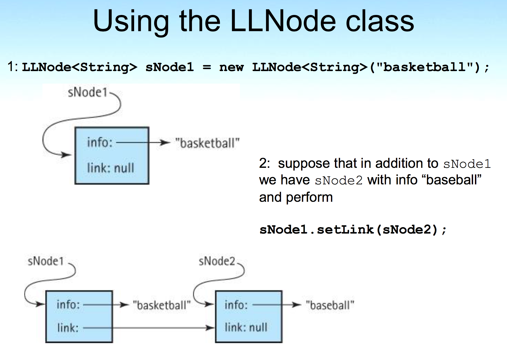
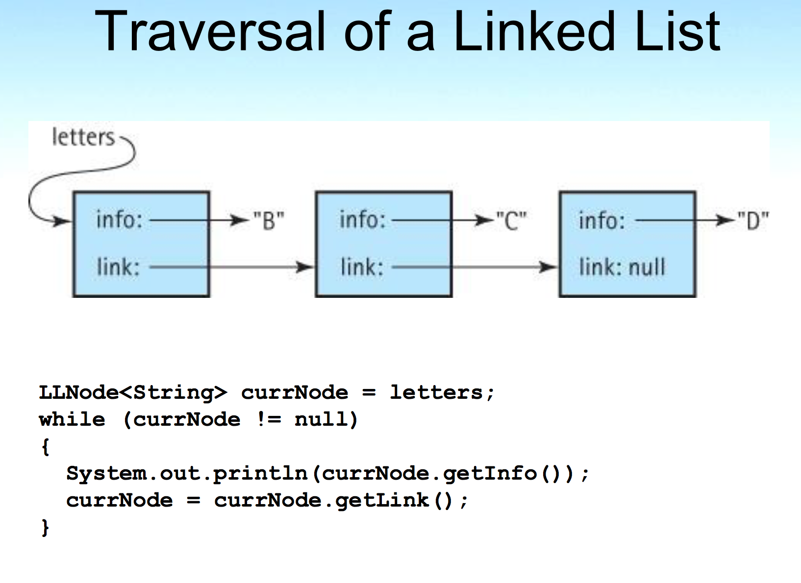
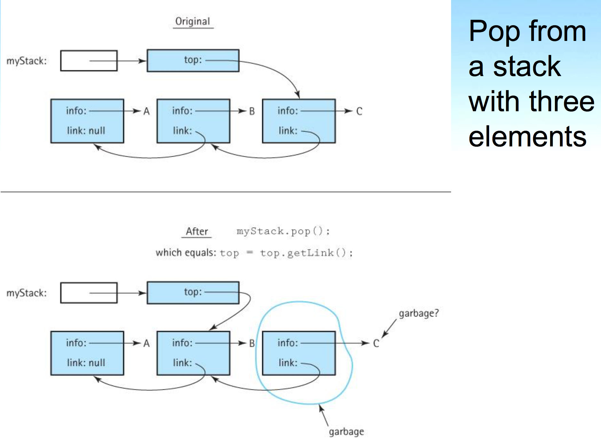
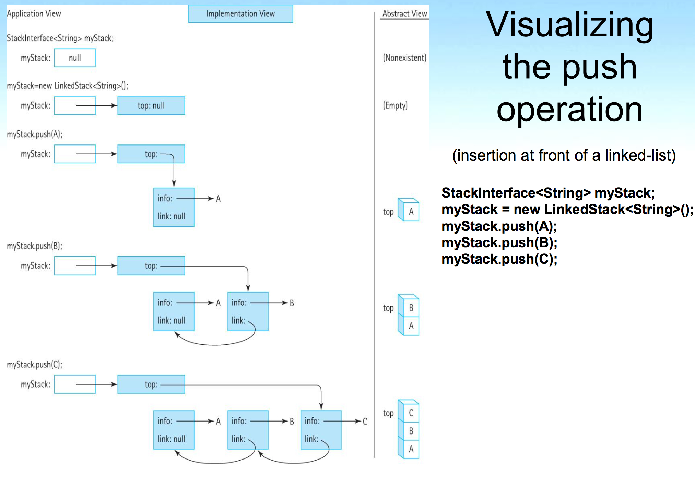

## Knowledge Goals

**explain the following terms and their relationships: abstraction, information hiding, data abstraction, data encapsulation, and abstract data type (ADT)**

1. **abstraction:** An abstraction is a model of a system that includes only the details essential to the perspective of the viewer of the system.
2. **information hiding:** Information hiding is the practice of hiding details within a module with the goal of simplifying the view of the module for the rest of the system.
3. **Data abstraction:** Data abstraction is the separation of a data type's logical properties from its implementation.
4. **Abstract data type (ADT):** An ADT is a data type whose properties (domain and operations) are specified independently of any particular implementation.

**describe the benefits of using an abstract data type**

* An ADT can be re-used at several places and it reduces coding efforts
* The application programmer who use the ADT do not need to know the variables inside it. They simply need to know how to create a ADT object and how to invoke its exported methods so as to use the object.

**define, for the Java programming language, the meanings of abstract method and interface**

1. An abstract method includes only a description of its parameters; no method bodies or implementations are allowed.
2. A Java interface looks very similar to a Java class. It can include variable declarations and methods. However, all variables declared in an interface must be constants and all methods must be abstract.

**describe the benefits of using a Java interface to specify an ADT**

1. We can formally check the syntax of our specification. When the interface is compiled, the compiler uncovers any syntactical errors in the method interface definitions.
2. We can formally verify that the syntactical part of the interface "contract" is satisfied by the implementation. When the implementation is compiled, the compiler ensures that the method names, parameters, and return types match those defined in the interface.
3. We can provide a consistent interface to applications from among alternatively implementations of the ADT. Some implementations may optimize the use of meemory space; others may emphasize speed. An implementation may also provide extra functionality beyond that defined in the interface. Yet all of the implementations will have the specified interface in common.

**list three options for making a collection ADT generally usable**

1. Collections of Class Object.
2. Collections of a class that implements a paticular interface.
3. Generic Collections.

**explain three ways to “handle” exceptional situations when defining an ADT**

1. handle the error within the method itself.
2. throw an exception.
3. ignore it.

**describe the Stack ADT from three perspectives: abstract level, application level, and implementation level**

1. *Application level:* As the application programmer, we use the ADT to solve a problem. When working on the application we only need to know what program statements to use to create instances of the ADT and invoke its operations. That is, our application is a client of the ADT. There can be many different clients that use the same ADT. We should note that a client of an ADT does not have to be an application — any code that uses the ADT is considered to be its client — it could even be code used in the implementation of another ADT.
2. *Abstract level:* This level provides an abstract view of the data values and the set of operations to manipulate them. Here we deal with the what questions: What is the ADT? What does it model? What are its responsibilities? What is its interface? At this level, the ADT designer, sometimes in consultation with intended client programmers, provides a specification of the properties of the ADT. This specification is used by the application/client programmer to decide when and how to use the ADT. And it is used by the implementation programmer who needs to create code that fulfills the specification.
3. *Implementation level:* The implementation programmer designs and develops a specific representation of the structure to hold the data as well as the implementation of the operations. Here we deal with the how questions: How do we represent and manipulate the data? How do we fulfilll the responsibilities of the ADT? There can be many different answers to these questions, resulting in multiple implementation approaches.

**classify a given stack operation as a constructor, observer, or transformer**

1. Constructor —  new
2. Transformers — push — pop
3. Observer — top

**describe an algorithm for determining whether grouping symbols (such as parentheses) within a string are balanced, using a stack**

```java
if(the character is an open symbol)
  Push the open symbol character onto the stack
else if(the character is a close symbol)
  if(the stack is empty)
    Set stillBalanced to false
  else
    Set open symbol character to the value at the top of the stack
    Pop the stack
    if(the close symbol character does not "match" the open symbol character)
      Set stillBalanced to false
else
  Skip the character
```

**describe an algorithm for evaluating postfix expressions, using a stack**

```java
while (more items exist)
  Get an item
  if (item is an operand)
    stack.push(item)
  else
    operand2 = stack.top()
    stack.pop()
    operand1 = stack.top()
    stack.pop()
    Set result to (apply operation corresponding to item to operand1 and operand2)
    stack.push(result)
result = stack.top()
stack.pop()
return result
```

## Skill Goal

**use the Java interface construct to formally specify an ADT**

```java
package ch02.figures;
public interface FigureInterface
{
  final double PI = 3.14;
  
  double perimeter();
  // Returns perimeter of this figure.
   
  double area();
  // Returns area of this figure.
}	
```

```java
package ch02.figures;
public class Circle implements FigureInterface
{
  protected double radius;
      
  public Circle(double radius)
  {
    this.radius = radius;
  }    
       
  public double perimeter()
  // Returns perimeter of this figure.
  {
    return(2 * PI * radius);
  }
   
  public double area()
  // Returns area of this figure.
  {
    return(PI * radius * radius);
  }
}
```

```java
package ch02.figures;
public class Rectangle implements FigureInterface
{
  protected double length, width;

  public Rectangle(double length, double width)
  {
    this.length = length;
    this.width = width;
  }    
       
  public double perimeter()
  // Returns perimeter of this figure.
  {
    return(2 * (length + width));
  }
   
  public double area()
  // Returns area of this figure.
  {
    return(length * width);
  }
}
```

**specify the preconditions and postconditions (effects) of a public method**

```java
public void increment()
//Preconditions:	Values of day, month, and year represent a valid date.
//					The value of year is not less than MINYEAR.
//
//Increments this IncDate to represent the next day.
```

**use the Java generics mechanism when designing and/or implementing and/or using an ADT**

```java
public class Stack<T>
{
  protected T[] elements;
  protected int topIndex = -1;
}
```

**define and use a self-referential class to build a linked list **

```java
public class LLNode<T>
{
  protected T info;
  protected LLNode<T> link;
  public LLNode(T info)
  {
    this.info = info;
    link = null;
  }
}
```

**draw figures representing a sequence of operations on a linked list**


**implement the Stack ADT using an array**

```java
package ch02.stacks;

public class ArrayBoundedStack<T> implements StackInterface<T> 
{
  protected final int DEFCAP = 100; // default capacity
  protected T[] elements;           // holds stack elements
  protected int topIndex = -1;      // index of top element in stack

  public ArrayBoundedStack() 
  {
    elements = (T[]) new Object[DEFCAP];
  }

  public ArrayBoundedStack(int maxSize) 
  {
    elements = (T[]) new Object[maxSize];
  }

  public void push(T element)
  // Throws StackOverflowException if this stack is full,
  // otherwise places element at the top of this stack.
  {      
    if (isFull())
      throw new StackOverflowException("Push attempted on a full stack.");
    else
    {
      topIndex++;
      elements[topIndex] = element;
    }
  }

  public void pop()
  // Throws StackUnderflowException if this stack is empty,
  // otherwise removes top element from this stack.
  {                  
    if (isEmpty())
      throw new StackUnderflowException("Pop attempted on an empty stack.");
    else
    {
      elements[topIndex] = null;
      topIndex--;
    }
  }

  public T top()
  // Throws StackUnderflowException if this stack is empty,
  // otherwise returns top element of this stack.
  {                 
    T topOfStack = null;
    if (isEmpty())
      throw new StackUnderflowException("Top attempted on an empty stack.");
    else
      topOfStack = elements[topIndex];
    return topOfStack;
  }

  public boolean isEmpty()
  // Returns true if this stack is empty, otherwise returns false.
  {              
    return (topIndex == -1); 
  }

  public boolean isFull()
  // Returns true if this stack is full, otherwise returns false.
  {              
    return (topIndex == (elements.length - 1));
  }
}**implement the Stack ADT using the Java library’s ArrayList class**
```

**implement the Stack ADT using a linked list**

```java
package ch02.stacks;

import support.LLNode;

public class LinkedStack<T> implements StackInterface<T>
{
  protected LLNode<T> top;   // reference to the top of this stack

  public LinkedStack()
  {
    top = null;
  }

  public void push(T element)
  // Places element at the top of this stack.
  { 
    LLNode<T> newNode = new LLNode<T>(element);
    newNode.setLink(top);
    top = newNode;
  }     

  public void pop()
  // Throws StackUnderflowException if this stack is empty,
  // otherwise removes top element from this stack.
  {                  
    if (isEmpty())
      throw new StackUnderflowException("Pop attempted on an empty stack.");
    else
      top = top.getLink();
  }

  public T top()
  // Throws StackUnderflowException if this stack is empty,
  // otherwise returns top element of this stack.
  {                 
    if (isEmpty())
      throw new StackUnderflowException("Top attempted on an empty stack.");
    else
      return top.getInfo();
  }

  public boolean isEmpty()
  // Returns true if this stack is empty, otherwise returns false.
  {              
    return (top == null); 
  }

  public boolean isFull()
  // Returns false - a linked stack is never full
  {              
      return false;
  }

}
```

**draw diagrams showing the effect of stack operations for a particular implementation of a stack**






**determine the order of growth efficiency of stack implementation operations**





**throw Java exceptions from within an ADT and catch them within an application that uses the ADT**

```java
package ch02.stacks;

public class StackOverflowException extends RuntimeException
{
  public StackOverflowException()
  {
    super();
  }

  public StackOverflowException(String message)
  {
    super(message);
  }
}
```

```java
package ch02.stacks;

public class StackUnderflowException extends RuntimeException
{
  public StackUnderflowException()
  {
    super();
  }

  public StackUnderflowException(String message)
  {
    super(message);
  }
}
```

**evaluate a postfix expression “by hand”**

```
5 7 + 6 2 - *
(5+7)*(6-2)
```

**use the Stack ADT as a component of an application**


