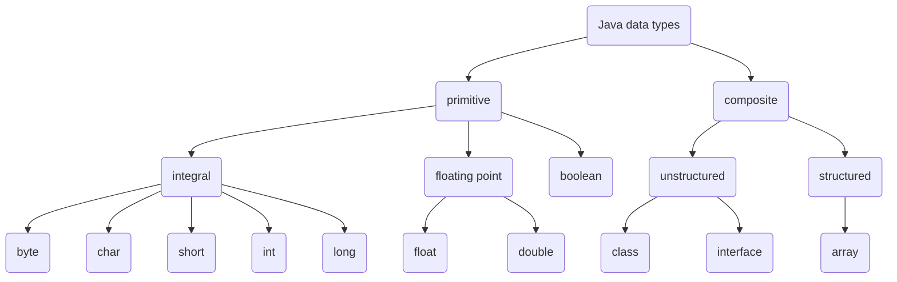

## Quiz

#### 1.

**Atomic of primitive type** : A data type whose elements are **single**, nondecomposable data items.

**Composite type**: A data type whose elements are **composed of multiple** data items.

#### 2.

#### 3.

**Abstaction**   A model of a system that includes only the details essential to the perspective of the viewer of the system.

**Information hiding**    The practive of hiding details within a module with th goal of controlling access to the details from the rest of the system.

**Data abstarction**    The seperation of a data type's logical properties from its implementation.

**Abstract data type(ADT)**    A data type whose properties (domain and operations) are specified independently of any particular implementation.